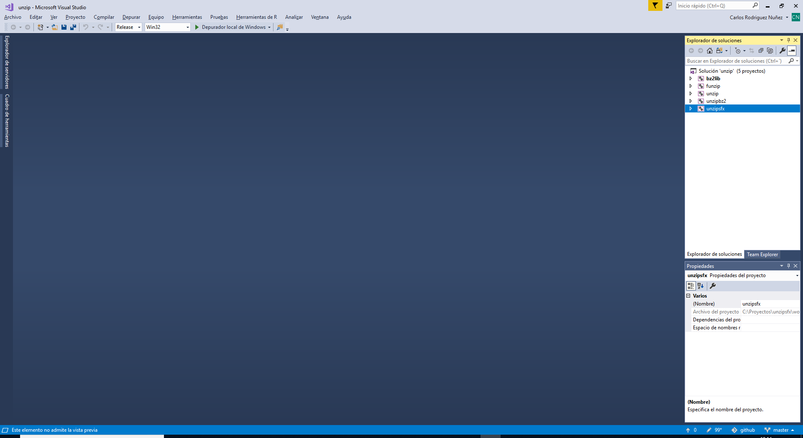
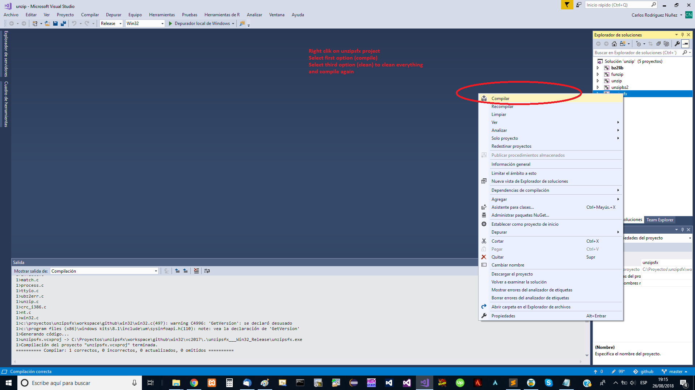
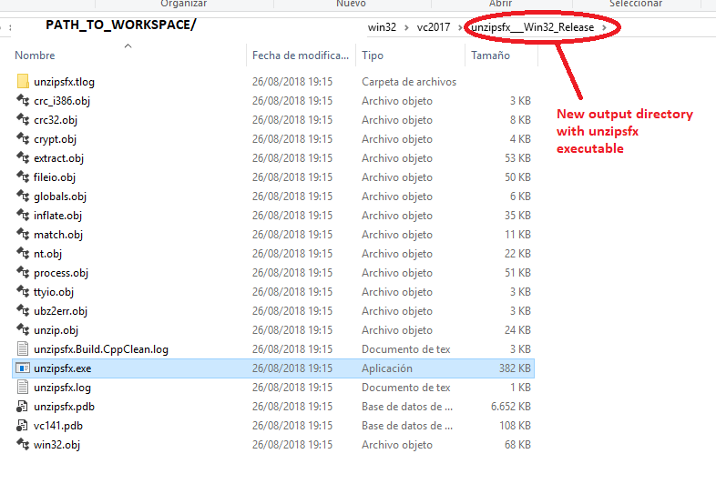

# unzipsfx-win32-build

## Overview

This README file describes the setup required to be able to compile unzipsfx-win32 on Windows Server 2016 (or any recent windows version).  

## Pre-requisites

To build unzipsfx install Visual Studio 2017 community edition, installer can be obtained [here](https://aka.ms/vs/15/release/vs_community.exe))
Run the installler and wait till installation has finished (can take a while).  

## Build steps

To build unzipsfx tool under Windows, follow the follow steps:

* Clone/Download this repository to the local machine:
  

* Using the Windows explorer, naviagate to the folder with the cloned source code **win32/vc2017** sub-directory.   
  

* Open **unzip.sln** from Visual Studio IDE:
  

* Once the solution is loaded, execute the following steps:
1. Select Release and Win32 configuration at top toolbar
2. Go to Solution Explorer on the right hand
3. Right click **unzipsfx**, select Compile option (first one), it will build the tool using its sources

Screenshot below describes the steps required:  

  

* Build process will create a new output folder under **win32/VC2017/unzipsfx___Win32_Release**
* The folder contains the **unzipsfx** executable 

  
  

