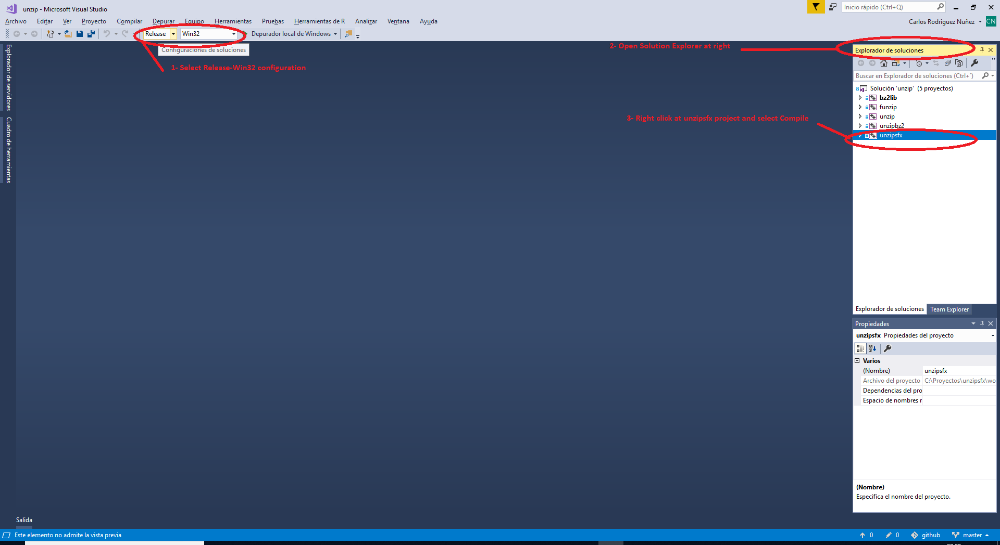

# unzipsfx-win32-build

## Overview

This README file describes the setup required to be able to compile unzipsfx-win32 at Windows Server 2016 (or any recent windows version)

## Pre-requisites

To build unzipsfx we need Visual Studio 2017 installed (free community edition installer can be obtained [here](https://aka.ms/vs/15/release/vs_community.exe)

We just need to download the installer, execute it and wait till installation has finished (can take a while)

## Build steps

To build unzipsfx tool under Windows, follow these steps:

* Be sure that pre-requisites are met (you have installed Visual Studio 2017 as described above).
* Clone/Download this repository into your local machine. You will obtain the following workspace:

* Using your windows explorer, go to the folder where you downloaded the codes, and then go to the **win32/vc2017** directory. 

* Double click the solution file **unzip.sln** (this will launch the Visual Studio IDE whose main screen is shown below).

* Once IDE is launched (see screenshot below), go to Solution Explorer section (at right), right click at **unzipsfx** (see screenshot below), select compile option, this will build the tool using sources.

* Build process will create a new output folder under **win32/VC2017/unzipsfx___Win32_Release** . This folder contains the unzipsfx executable.

